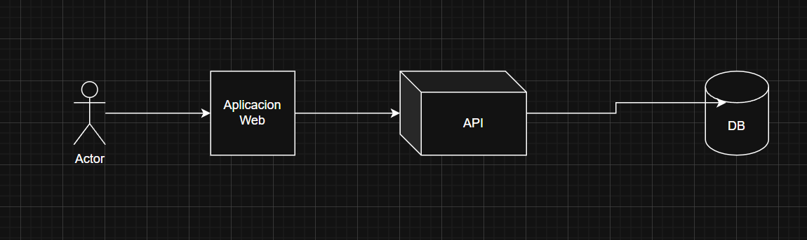
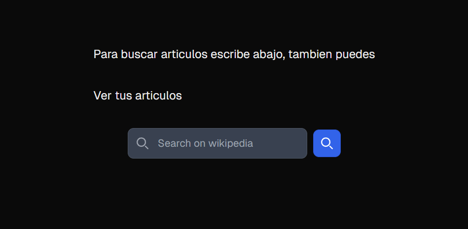
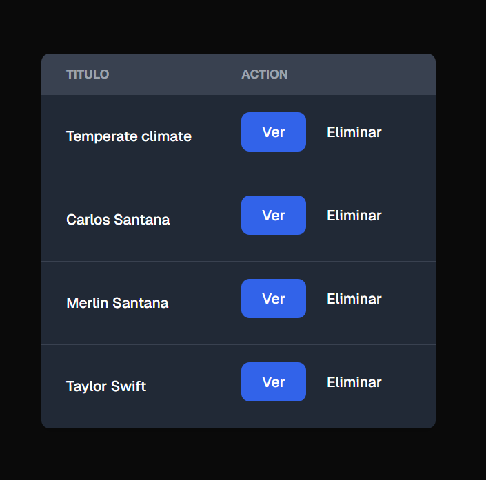
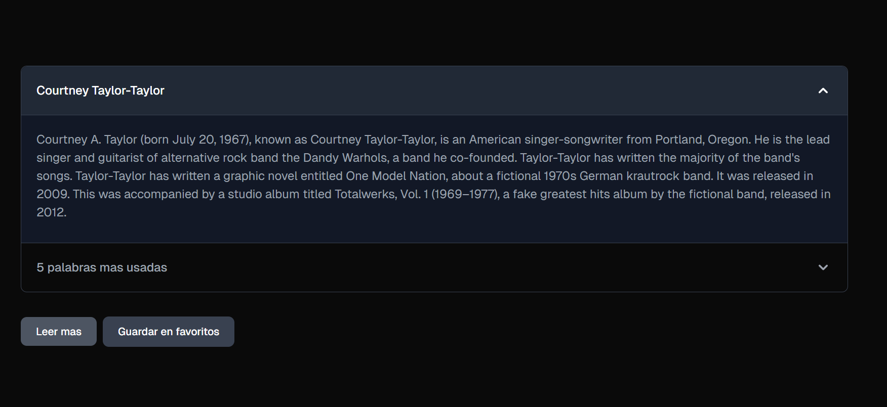
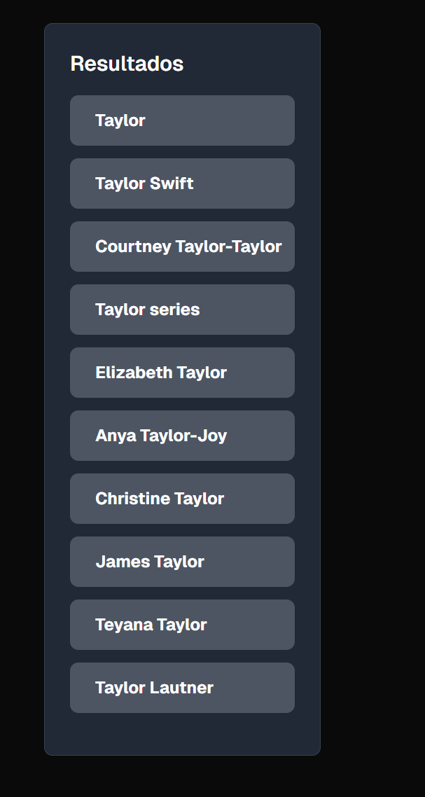

# Instrucciones de ejecución

Deben tener docker instalado si no lo tienen lo pueden descargar [aqui](https://www.docker.com/products/docker-desktop/)

Una vez docker esté instalado clona el repositorio

```
git clone https://github.com/marti700/crecer.git

```
luego acceder al directorio crecer

```
cd crecer
```

y dentro del directorio deben puden correr el comando:

```
docker compose up --build
```
y la aplicación comenzará a ejecutarse luego de unos minutos.

Puedes acceder a la aplicación usando este link [http://localhost:3001](http://localhost:3001)

# Arquitectura

El sistema sigue una arquitectura de cliente servidor en la que el usuario
accede a una aplicación web (el cliente) desde un navegador y el navegador
interactua con un [API](https://en.wikipedia.org/wiki/API) (el servidor). El
servidor persiste los articulos guardados por el usuario en una base de datos de
postgres.

En la imagen de abajo se ilustra este proceso:



Para seguir un diseño completamente modular decidí que todas las partes del
sistema se ejecutarán en contenedores, asi que el backend, el frontend así como
la base de datos se ejecuta en contenedores individuales.

Para almacenar los artículos del usuario se utiliza una base de datos de
postgress SQL. Decidí usar postgres porque la data está bien estructurada y
parece ser que la estructura de la data no cambia frecuentemente.

Esta es la estructura de la tabla donde se guardan los artículos del usuario:

CREATE TABLE IF NOT EXISTS article_details (
    id SERIAL PRIMARY KEY,
    title TEXT NOT NULL UNIQUE,
    url TEXT NOT NULL,
    summary TEXT NOT NULL,
    saved_date TIMESTAMP DEFAULT CURRENT_TIMESTAMP
);

Esta tabla solo sirve para que el usuario lleve registro de los artículos
guardados. Esta es la única tabla que tiene la base de datos.

Dada la naturaleza de wikipedia entiendo que sus articulos pueden ser
modificados con mucha frecuencia por lo que estime que una sola tabla donde el
usuario pueda ver sus archivos guardados era mejor que guardar en la base de
datos todos los detalles que se procesaban en el backend, pues eventualmente los
datos procesados estarán desactualizados y se mostrará al usuario información
erronea.

## En el backend

De acuerdo a los requerimientos se utilice fastAPI para desarrollar API con el que
se comunica la aplicación web. El API cuenta con los endpoints siguientes:

### /search/article/{name}

Busca artículos en wikipedia basándose en el parámetro nombre.

Segun la [documentación del API de wikipedia](https://www.mediawiki.org/wiki/API:Search)
los artículos se puede buscar usando este endpoint:

https://en.wikipedia.org/w/api.php?action=query&list=search&srsearch=nelson%20mandela&utf8&format=json

Esto devuelve una lista de artículos relacionados al término de búsqueda
(srsearch) de esta respuesta se toma el nombre del artículo.

**Ejemplo del response:**
```json
[
  {
    "title": "Taylor",
    "snippet": "up \u003Cspan class=\"searchmatch\"\u003ETaylor\u003C/span\u003E in Wiktionary, the free dictionary. \u003Cspan class=\"searchmatch\"\u003ETaylor\u003C/span\u003E, \u003Cspan class=\"searchmatch\"\u003ETaylors\u003C/span\u003E or \u003Cspan class=\"searchmatch\"\u003ETaylor&#039;s\u003C/span\u003E may refer to: \u003Cspan class=\"searchmatch\"\u003ETaylor\u003C/span\u003E (surname) List of people with surname \u003Cspan class=\"searchmatch\"\u003ETaylor\u003C/span\u003E \u003Cspan class=\"searchmatch\"\u003ETaylor\u003C/span\u003E (given"
  },
  {
    "title": "Taylor Swift",
    "snippet": "\u003Cspan class=\"searchmatch\"\u003ETaylor\u003C/span\u003E Alison Swift (born December 13, 1989) is an American singer-songwriter. Known for her autobiographical songwriting, artistic versatility, and cultural"
  },
  {
    "title": "Taylor series",
    "snippet": "In mathematics, the \u003Cspan class=\"searchmatch\"\u003ETaylor\u003C/span\u003E series or \u003Cspan class=\"searchmatch\"\u003ETaylor\u003C/span\u003E expansion of a function is an infinite sum of terms that are expressed in terms of the function&#039;s derivatives"
  }
]
```

### /search/article/{name}/details

En este endpoint se hace el procesamiento del artículo que se mostrará al
usuario, a este endpoint se le pasa el nombre del artículo como parámetro

#### Resumen conciso

En mi opinión las introducciones de los artículos de wikipedia son un buen
resumen del artículo.

Utilizo la extension [extracts](https://www.mediawiki.org/wiki/Extension:TextExtracts#API)
del api de wikipedia para extraer el contenido de la introducción del
artículo en texto plano.

Por ejemplo:
https://en.wikipedia.org/w/api.php?format=json&action=query&prop=extracts&exintro&explaintext&redirects=1&titles=nelson_mandela&utf8

#### Las 5 palabras más frecuentes

Usando la extension [extracts](https://www.mediawiki.org/wiki/Extension:TextExtracts#API) del api de wikipedia se puede obtener el contenido completo del artículo en texto plano al usar el parámetro exlimit=max

por ejemplo:
https://en.wikipedia.org/w/api.php?format=json&action=query&prop=extracts&exlimit=max&explaintext&redirects=1&titles=taylor_swift&utf8

Una vez obtenido todo el contenido del artículo, recorro todo el texto y guardar
todas las palabras en un diccionario y usando un
[heap](https://www.geeksforgeeks.org/heap-data-structure/) retorno las 5 mas
frecuentes

Este endpoint retorna:

1. Titulo,
2. Resumen
3. Top 5 palabras que más se repiten
4. Análisis simple de sentimiento

**Ejemplo del response**
```json
{
  "title": "taylor swift",
  "summary": "Taylor Alison Swift (born December 13, 1989) is an American singer-songwriter. Known for her autobiographical songwriting, artistic versatility, and cultural impact, Swift is one of the world's best-selling....",
  "words": [
    [190, "Swift"
    ],
    [55, "first"
    ],
    [46, "Swift's"
    ],
    [44, "Music"
    ],
    [39, "album"
    ]
  ]
}
```

### /articles/save
Guarda artículos en la base de datos, si todo sale bien responde con un http 201, si no retorna un http 500

### /articles
lista todos los artículos de la base de datos

**Ejemplo del response:**
```json
[
  {
    "title": "Temperate climate",
    "summary": "In geography, the temperate climates of Earth occur in the middle latitudes (approximately 23.5° to 66.5° N/S of the Equator), which span between the tropics and the polar regions of Earth. These zones generally have wider temperature ranges throughout the year and more distinct seasonal changes compared to tropical climates, where such variations are often small; they usually differ only in the amount of precipitation.\nIn temperate climates, not only do latitudinal positions influence temperature changes, but various sea currents, prevailing wind direction, continentality (how large a landmass is) and altitude also shape temperate climates.\nThe Köppen climate classification defines a climate as \"temperate\" C, when the mean temperature is above −3 °C (26.6 °F) but below 18 °C (64.4 °F) in the coldest month to account for the persistence of frost. However, some adaptations of Köppen set the minimum at 0 °C (32.0 °F). Continental climates are classified as D and considered to be varieties of temperate climates, having more extreme temperatures, with mean temperatures in the coldest month usually being below −3 °C (26.6 °F).",
    "url": "https://en.wikipedia.org/Temperate climate"
  },
  {
    "title": "Merlin Santana",
    "summary": "Merlin Santana (March 14, 1976 – November 9, 2002) was an American actor and rapper. Beginning his career in the early 1990s, Santana was best known for his roles as Rudy Huxtable's boyfriend Stanley on The Cosby Show, Marcus Dixon on Getting By, Marcus Henry in Under One Roof and Romeo Santana on The WB sitcom The Steve Harvey Show (1996 – 2002). He was also known for his recurring role as Ohagi on the UPN sitcom Moesha.\nOn November 9, 2002, Santana was shot dead in Los Angeles by 19-year-old Damien Andre Gates, ordered by Gates' girlfriend Monique King, who falsely accused Santana of making sexual advances towards her.",
    "url": "https://en.wikipedia.org/Merlin Santana"
  },
]
```

### /article/delete/{title}
borra el artículo de la base de datos pasado como parámetro, si todo sale bien retorna un http 200, sino un código http 500 es retornado


## El frontend

De acuerdo a los requerimientos se usó next.js para desarrollar la aplicación
web con la que el usuario interactua.

a continuación una breve descripción de las diferentes páginas y cómo interactuar con ellas:

### /

Esta es la primera página que el usuario verá al acceder a la aplicación web. En
esta página el usuario puede acceder a los artículos que haya guardado
anteriormente al hacer click en el enlace `ver tus artículos guardados` o pude
buscar artículos nuevos al escribir en la barra de búsqueda.



### /article/myarticles

/article/myarticles

En esta ruta el usuario puede ver los artículos que ha guardado previamente y
decidir si quiere verlos o eliminarlos, si presiona el botón de eliminar, el
sistema eliminará el archivo de la base de datos. Si presiona el botón ver será
redireccionado a la ruta [/article/details/{title}](###/article/details/{title})



### /article/details/{title}

Esta ruta es donde el usuario puede ver los detalles del artículo. Se puede
acceder a ella desde la tabla de artículos guardados en
[/article/myarticles](###/article/myarticles) o desde la lista de resultados de
busqueda en [/article/details/title](/article/details/{title})

Aquí el usuario podrá ver un resumen del artículo y las 5 palabras mas usadas,
también el usuario podrá si asi lo desea acceder directamente al articulo de
wikipedia para continuar leyendo.

Si el usuario viene de la página de [resultados de
busqueda](###/article/results/{title}), el usuario podra usar el boton de
`guardar archivo`



### /article/results/{title}

A esta ruta se accede cuando el usuario realiza una búsqueda en la
[pantalla principal][###/]. Aquí se muestran los resultados relevantes de
búsqueda. Si no se encuentran resultados relevantes, simplemente no se muestra
nada.



# Sobre los extras

**Lo que pude hacer:**

Pude implementar análisis del sentimiento simple usando la Librería TextBlob.

**Lo que no pude hacer por razones de tiempo pero como lo hubiese hecho:**

- Detección de entidades (NER): hay varias librerías disponibles que pueden hacer esto como Spacy, NLTK o usando la librería Transformers de Hugging Face

- Paginación en "Mis Artículos Guardados": Hay una librería llamada [HeroUI](https://www.heroui.com/docs/components/table) que ofrece un componente de tabla para react con funcionalidad de paginación.
